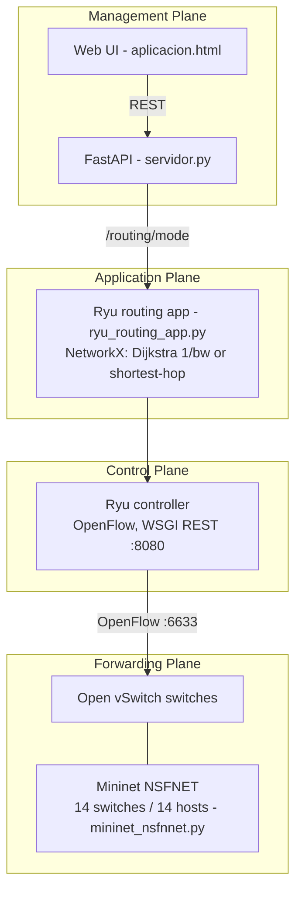

# SDN Controller over NSFNET — Ryu + Mininet

> **TL;DR** — A Software-Defined Networking project that separates the four network planes and lets you
> pick a routing algorithm from a web panel and apply it live over a simulated **NSFNET** topology. The
> control plane (Ryu) computes paths with NetworkX (Dijkstra weighted by `1/bandwidth`, or shortest-hop)
> and the management plane (FastAPI + web UI) drives it.
>
> **Stack:** Ryu · Mininet + Open vSwitch · NetworkX · FastAPI · vanilla JS UI. **Domain:** telecom / SDN.

---

## 1. What it solves
Classic networks couple forwarding and control on each device. SDN centralizes control so routing policy
becomes software you can change on the fly. This project demonstrates that end to end on the 14-node
**NSFNET** topology: choose a routing strategy in the UI and see the controller recompute and program paths.

## 2. The four planes



| Plane | Component | Role |
|---|---|---|
| Forwarding | Mininet + Open vSwitch (`mininet_nsfnnet.py`) | 14-switch NSFNET topology, `TCLink` bandwidth |
| Control | Ryu controller | Speaks OpenFlow to the switches; exposes a WSGI REST API |
| Application | `ryu_routing_app.py` | Builds the graph with NetworkX, computes routes, programs flows |
| Management | `servidor.py` (FastAPI) + `aplicacion.html` | Start apps, pick algorithm, monitor state |

## 3. Run it (Linux / WSL2 recommended)
```bash
python3 -m venv .venv && source .venv/bin/activate
pip install -r requirements.txt
# 1) Controller + routing app
ryu-manager ryu_routing_app.py &          # Ryu REST API on :8080
# 2) Topology
sudo python3 mininet_nsfnnet.py            # 14 switches + hosts h1..h14 -> RemoteController 127.0.0.1:6633
# 3) Management API
uvicorn servidor:app --host 0.0.0.0 --port 8000 --reload
# 4) UI
python3 -m http.server 5500                # open http://localhost:5500/aplicacion.html
```
In the UI, pick **Dijkstra (1/bandwidth)** or **shortest-hop** and apply it; the request proxies through
FastAPI to the Ryu app, which recomputes routes. Generate traffic from the Mininet CLI (`h1 ping h2`,
`iperf`) to observe behavior.

## 4. Scope & limitations (honest status)
This is an academic project demonstrating the SDN plane separation. Current implementation:
- Route computation with NetworkX and REST endpoints: **working**.
- Proactive flow installation via `OFPFlowMod` and port mapping between switches: **partial** — the app
  builds the graph and exposes the control API; full match/timeout/priority rules and automatic
  recomputation on link/switch-down events are the natural next steps.

## 5. Requirements
Python 3.8+, Mininet (install via `apt`), Open vSwitch (ships with Mininet), Ryu (`pip install ryu`).
